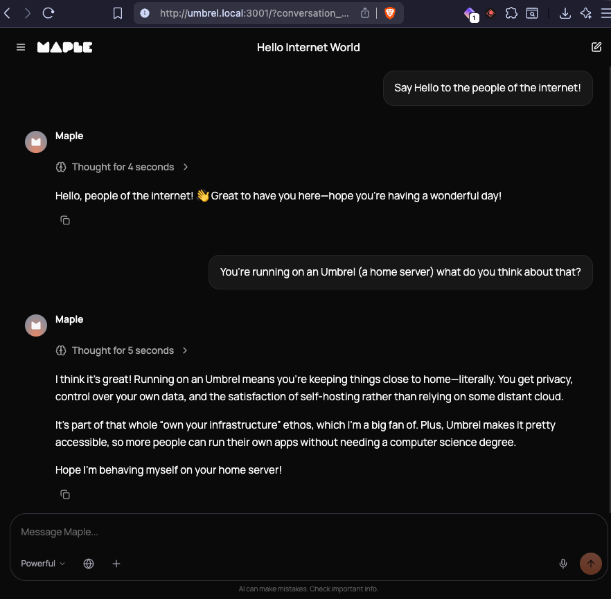

# Maple AI — Umbrel Community App

This repo packages [Maple AI](https://github.com/OpenSecretCloud/Maple) as a community app for [Umbrel](https://umbrel.com).

> **I am not the developer of Maple.** Maple is built by [OpenSecret](https://opensecret.cloud). I just packaged it for Umbrel.

## What is Maple?

Maple is a private AI chat app that runs your conversations through Trusted Execution Environments (TEEs) — secure enclaves that guarantee no one, not even OpenSecret, can read your messages. It also exposes an OpenAI-compatible API endpoint so you can connect tools like Cursor, Open WebUI, or LiteLLM to it using your Maple API key.

## Installation

1. Open the Umbrel App Store
2. Click the **⋯** (horizontal ellipsis) menu in the top-right corner
3. Select **Add community app store**
4. Paste this URL:
   ```
   https://github.com/SpencerSmithSite/maple-umbrel
   ```
5. Click **Add** — Maple AI will appear in your app store under the **AI** category

## Browser requirement (Chrome / Brave)

Maple uses cryptographic APIs that browsers normally restrict to HTTPS. Since Umbrel serves apps over plain HTTP, you need to whitelist the app's origin once:

1. Open `chrome://flags/#unsafely-treat-insecure-origin-as-secure`
2. Paste `http://umbrel.local:3001` into the text box
3. Set the flag to **Enabled**
4. Click **Relaunch**

This is a one-time step per browser profile. Firefox does not require it.

## Links

- Maple source code: https://github.com/OpenSecretCloud/Maple
- OpenSecret: https://opensecret.cloud
- Issues with this packaging: https://github.com/SpencerSmithSite/maple-umbrel/issues
